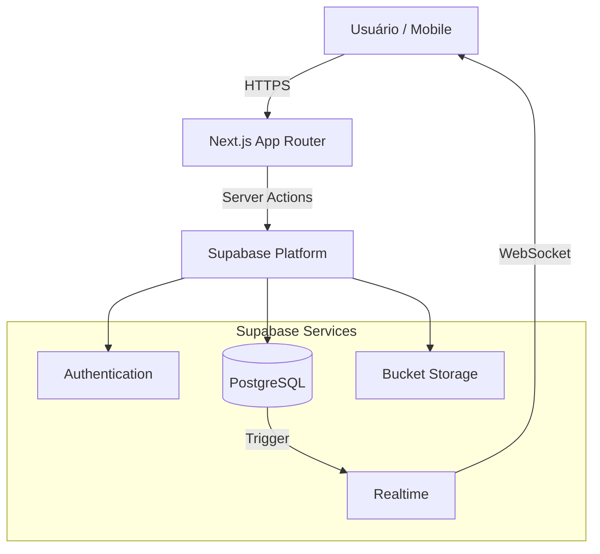
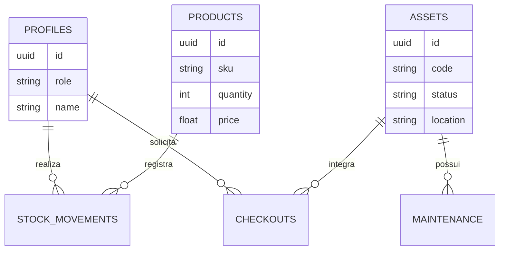

<div align="center">
  
  
  <h1>Sis Davus</h1>
  <h3>Sistema Integrado de Gestão Empresarial (ERP)</h3>
  
  <p>
    <strong>Versão 4.2.0</strong> | Arquitetura Serverless & Zero Cost
  </p>
  
  <p>
    
    
    
    
    
    
  </p>
  
  <p>
    <a href="#-sobre-o-projeto">Sobre</a> •
    <a href="#-funcionalidades">Funcionalidades</a> •
    <a href="#-stack-tecnológica">Tecnologias</a> •
    <a href="#-experiencia-do-usuario">UX/UI</a> •
    <a href="#-desenvolvimento">Desenvolvimento</a> •
    <a href="#-deploy">Deploy</a>
  </p>
</div>

---

## 📋 Sobre o Projeto

O **Sis Davus** é uma plataforma ERP (Enterprise Resource Planning) de alta performance desenvolvida para a Davus Engenharia. O sistema centraliza a gestão de ativos, estoque, manutenções e processos administrativos em uma interface moderna, responsiva e segura.

Diferente de sistemas tradicionais, o Sis Davus opera com uma arquitetura **Serverless "Zero Cost"**, utilizando o poder do **Next.js 15 (App Router)** e **Supabase** para oferecer escalabilidade infinita sem custos fixos de infraestrutura.

---

## ✨ Funcionalidades

### 🏢 Módulos Principais

#### 📦 Gestão de Estoque (`/estoque`)
- **Controle Total**: Rastreamento de entradas e saídas de materiais em tempo real.
- **Categorização Avançada**: Organização por Centros de Custo, Categorias e Locais de Armazenamento.
- **Alertas Automáticos**: Notificações visuais e sonoras para estoque baixo ou crítico.
- **Histórico**: Registro detalhado, buscável e filtrável de todas as movimentações.

#### 🏷️ Gestão Patrimonial (`/patrimonio`)
- **Ativos Inteligentes**: Identificação única via Tags QR Code customizáveis.
- **Ciclo de Vida**: Acompanhamento desde a aquisição até o descarte (Disponível, Em Uso, Manutenção, Baixado).
- **Timeline de Ativos**: Histórico cronológico completo de cada equipamento (quem usou, onde esteve, manutenções).
- **Manutenções**: Agendamento e controle de manutenções preventivas e corretivas.

#### 📱 Checkouts & Mobile (`/checkouts`)
- **Experiência de E-commerce**: Sistema de "carrinho" para requisição de múltiplos itens e ativos.
- **Scanner Mobile**: Leitura instantânea de QR Codes via câmera do celular/tablet sem apps extras.
- **Assinatura Digital**: Validação de retiradas e devoluções para compliance.

#### 📊 Dashboards & Analytics (`/dashboard`)
- **Visão Executiva**: KPIs financeiros, taxa de giro de estoque e valor patrimonial atualizado.
- **TV Mode**: Dashboard otimizado (`/dashboard/tv`) para exibição em televisores no chão de fábrica/escritório.
- **Diagnóstico**: Ferramenta de análise de integridade dos dados e consistência do sistema.

### 🛡️ Módulos Administrativos (`/admin`)

- **Hub Admin**: Central de controle para gestores.
- **Gestão de Usuários (RBAC)**: Controle granular de perfis (Admin, Gestor, Operador) e permissões.
- **Audit Logs Imutáveis**: Registro de "quem fez o quê e quando" para segurança e conformidade.
- **Dados Mestres**: Gestão unificada de Centros de Custo (`/admin/centros-custo`) e Locais (`/admin/locais`).

### 🔧 Utilitários do Sistema

- **Modo Offline**: Sincronização automática de dados quando a conexão é restabelecida.
- **Relatórios**: Exportação nativa de dados para PDF (com layout oficial) e Excel (XLSX).
- **Notificações**: Central de avisos (`/notificacoes`) para pendências e alertas do sistema.
- **Segurança**: Políticas RLS (Row Level Security) garantem que usuários vejam apenas o que devem.

---

## 🎨 Experiência do Usuário (UX/UI)

O projeto prioriza uma experiência **Premium** e **Fluida**, utilizando as melhores práticas de Design System:

- **Command Palette (`Ctrl+K`)**: Navegação super-rápida via teclado para qualquer lugar do sistema.
- **PWA (Progressive Web App)**: Instalável em celulares e desktops, comportando-se como app nativo.
- **Sound Design**: Feedback sonoro sutil para ações de sucesso, erro e alertas (com opção de mute).
- **Onboarding Tour**: Guia interativo para novos usuários conhecerem o sistema.
- **Motion Design**: Animações fluidas com Framer Motion e GSAP para transições de página e micro-interações.
- **Gestos Mobile**: Suporte a "Pull-to-Refresh" e interações por toque otimizadas.
- **Temas**: Suporte nativo a Dark Mode e Light Mode com persistência de preferência.

---

## 🏗️ Arquitetura

O sistema segue uma arquitetura moderna e desacoplada, garantindo escalabilidade e facilidade de manutenção.

### Fluxo de Dados



### Modelagem de Dados (ERD)



---

## �💻 Stack Tecnológica

| Camada | Tecnologia | Detalhes |
|--------|------------|----------|
| **Framework** | [Next.js 15.5](https://nextjs.org/) | App Router, Server Actions, Turbopack |
| **Runtime** | [Bun](https://bun.sh/) | Gerenciamento de pacotes e scripts ultra-rápido |
| **Linguagem** | [TypeScript 5](https://www.typescriptlang.org/) | Tipagem estrita para segurança de código |
| **Estilização** | [Tailwind CSS v4](https://tailwindcss.com/) | Engine v4 para performance máxima |
| **UI Kit** | [Shadcn/UI](https://ui.shadcn.com/) | Componentes acessíveis baseados em Radix UI |
| **Backend** | [Supabase](https://supabase.com/) | Auth, PostgreSQL, Storage, Realtime |
| **State** | React Context + URL State | Gerenciamento de estado híbrido e performático |
| **Testes** | [Playwright](https://playwright.dev/) | Testes End-to-End (E2E) robustos |

**Bibliotecas Chave:**
- `framer-motion` & `gsap`: Animações complexas.
- `recharts`: Visualização de dados.
- `html5-qrcode` & `qrcode.react`: Ecossistema de QR Code.
- `jspdf` & `exceljs`: Geração de documentos no cliente.
- `sonner`: Toasts e notificações.
- `cmdk`: Command Palette acessível.
- `driver.js`: Tours guiados.

---

## 🚀 Desenvolvimento

### Pré-requisitos
- Node.js 20+ ou Bun 1.1+ (Recomendado)
- Conta no Supabase (Gratuita)

### Configuração Inicial

1. **Clone o repositório:**
```bash
git clone https://github.com/charlles-dev/sis-davus.git
cd sis-davus
```

2. **Instale as dependências:**
```bash
bun install
```

3. **Configure as Variáveis de Ambiente:**
Crie um arquivo `.env.local` na raiz:
```bash
NEXT_PUBLIC_SUPABASE_URL="sua_url"
NEXT_PUBLIC_SUPABASE_ANON_KEY="sua_chave"
```

4. **Execute o Servidor de Desenvolvimento:**
```bash
bun run dev
```
O sistema estará acessível em `http://localhost:3000`.

### Comandos Úteis

- `bun run dev`: Inicia servidor local (com Turbopack).
- `bun run build`: Cria build de produção.
- `bun run lint`: Verifica erros de linting.
- `bun test:e2e`: Executa testes de interface com Playwright.

---

## 📂 Estrutura do Projeto

```text
src/
├── app/                 # App Router (Páginas)
│   ├── (auth)/          # Login e Recuperação de Senha
│   ├── (dashboard)/     # Layout Protegido (Sidebar + Topbar)
│   │   ├── admin/       # Rotas de Administração
│   │   ├── estoque/     # Rotas de Estoque
│   │   ├── patrimonio/  # Rotas de Ativos
│   │   └── ...
│   └── api/             # API Endpoints (Next.js API Routes)
├── components/          # Biblioteca de Componentes
│   ├── ui/              # Componentes Base (Botões, Inputs, Cards)
│   └── ...              # Componentes de Negócio (QRScanner, Charts)
├── hooks/               # Custom Hooks (useDashboardData, useMobile)
├── lib/                 # Utilitários (Supabase Client, Formatadores)
├── services/            # Camada de Dados (Abstração do Banco)
├── styles/              # CSS Global e Design Tokens
└── types/               # Tipagem TypeScript Global e do Banco
```

---

## 🚢 Deploy

O projeto conta com **CI/CD Integrado** na Netlify.

**Passos para Deploy Manual:**
1. Importe o repositório na [Netlify](https://www.netlify.com).
2. O Netlify detectará automaticamente o framework Next.js.
3. Configure as variáveis de ambiente (mesmas do `.env.local`) nas configurações do site (`Site settings > Environment variables`).
4. Deploy!

A plataforma oferece suporte nativo ao Next.js Runtime, garantindo que Server Actions e API Routes funcionem perfeitamente.

---

## 👥 Créditos

Desenvolvido com ❤️ pela equipe [**Delta Rise**](https://deltarise.com.br) para [**Davus Engenharia**](https://davusengenharia.com.br).

### Core Team
- [**Charlles Augusto**](https://github.com/charlles-dev) - *Lead Architect & Full Stack*
- [**Flaviano Rodrigues**](https://github.com/flavianorodrigues147-a11y) - *Backend & DevOps*
- [**Weidy Lucena**](https://github.com/Weidyzk) - *Documentation & QA*
- [**Savio Bezzera**](https://github.com/saviobezerra) - *Backend & QA*
- [**Natalia Araújo**](https://github.com/nataliaraujo-me) - *Backend & UX*
- [**Rafael Leal**](https://github.com/rafaelalm-Leal) - *Backend & QA*
- [**Edielson Miranda**](https://github.com/Edi-elson) - *Backend & QA*

### Agradecimentos
À estrutura da [**Davus Engenharia**](https://davusengenharia.com.br) pela oportunidade e confiança, e especialmente à orientadora [**Profª Ana Paula**](https://github.com/profanacgpb) pelo suporte acadêmico fundamental para o desenvolvimento deste projeto.

---

## 📄 Licença

Propriedade intelectual reservada.
© 2026 [**Delta Rise**](https://deltarise.com.br)
