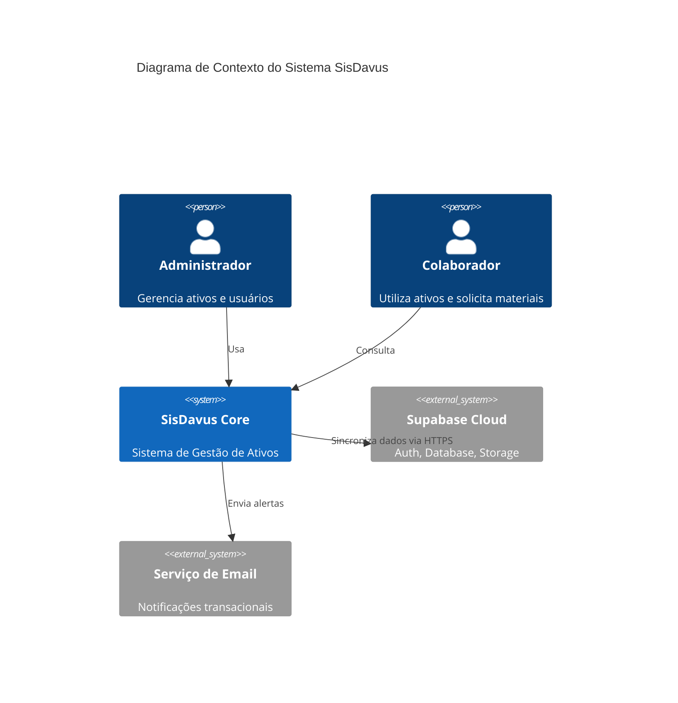
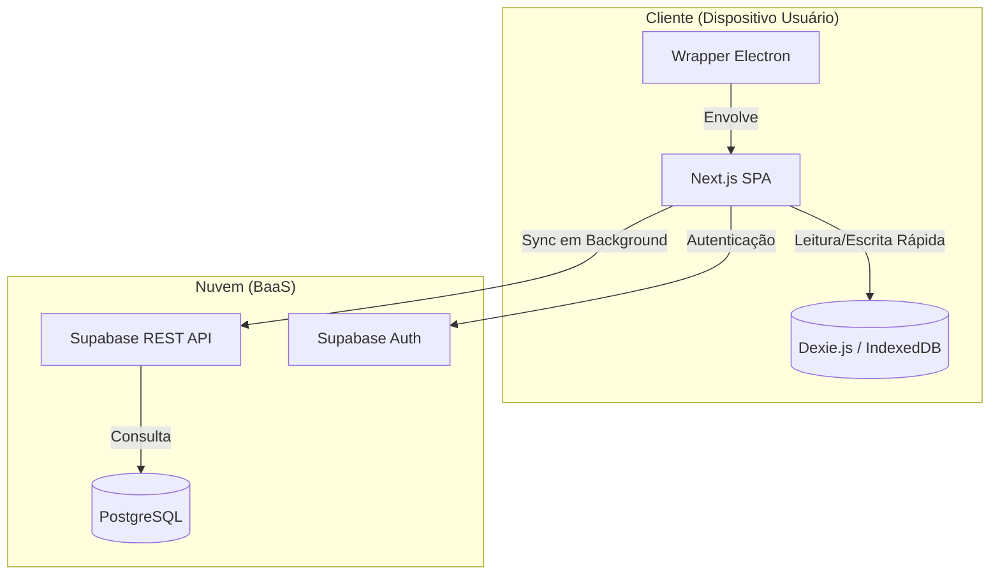

# 04. Arquitetura do Sistema (System Design Document)

## 1. Visão Geral da Arquitetura

O SisDavus adota uma arquitetura **Híbrida de Cliente Rico (Rich Client)** com capacidades **Offline-First**. O sistema não é nem puramente web (tem instalador local via Electron) nem puramente desktop (a base de código é web/React).

### Estilo Arquitetural
- **Client-Server**: Para operações online tradicionais.
- **Local-First (Edge Computing)**: O processamento de dados e validações ocorrem primariamente no dispositivo do usuário, utilizando recursos locais (CPU/Storage) para garantir performance e disponibilidade.

---

## 2. Modelo C4 (Context, Containers, Components)

### Nível 1: Diagrama de Contexto
Visão macro das integrações do sistema.

### Nível 2: Diagrama de Containers
Detalhamento das unidades de implantação.

---

## 3. Decisões de Design (ADRs)

### ADR-001: Adoção do Modelo Offline-First
- **Contexto**: O sistema será usado em galpões e locais com Wi-Fi instável.
- **Decisão**: Utilizar `Dexie.js` como fonte primária de verdade para a UI. O servidor é tratado como um "backup remoto" e ponto de sincronização.
- **Consequências**:
    - (+) A UI é instantânea (zero latência de rede).
    - (+) Funciona totalmente sem internet.
    - (-) Complexidade aumentada para gerenciar conflitos de dados.
    - (-) Necessidade de duplicar lógica de validação (Front e Back).

### ADR-002: Electron vs PWA
- **Contexto**: Necessidade de acesso a hardware (impressoras térmicas, scanners USB no futuro) e percepção de "software robusto" pelo cliente.
- **Decisão**: Encapsular a aplicação Web em Electron.
- **Consequências**:
    - (+) Acesso a APIs nativas do SO.
    - (+) Instalação via `.exe` simplifica deployment corporativo via GPO.
    - (-) Tamanho do executável maior (~100MB).

### ADR-003: Backend-as-a-Service (Supabase)
- **Contexto**: Prazo curto de entrega e necessidade de Realtime.
- **Decisão**: Utilizar Supabase em vez de desenvolver backend customizado (Node/Java).
- **Consequências**:
    - (+) Velocidade de desenvolvimento (Auth e DB prontos).
    - (+) Custo inicial zero.
    - (-) Vendor Lock-in (acoplamento forte com a plataforma Supabase).

---

## 4. Teorema CAP

Na teoria de sistemas distribuídos (Brewer's Theorem), o SisDavus prioriza **Availability (A**) e **Partition Tolerance (P)** em detrimento de Consistency (C) imediata.
- O sistema é **Eventual Consistent**: Os dados podem estar temporariamente desatualizados entre dois clientes offline, mas convergirão para um estado consistente quando a conexão retornar.

---

