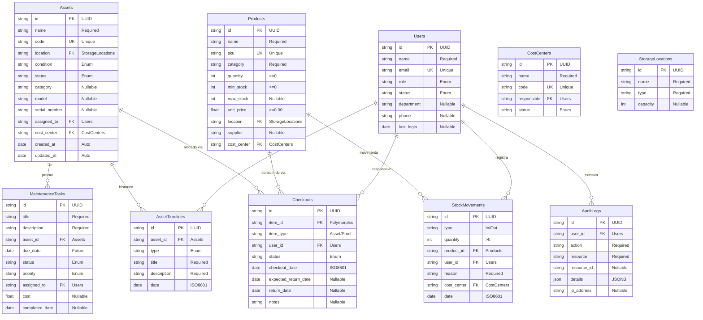
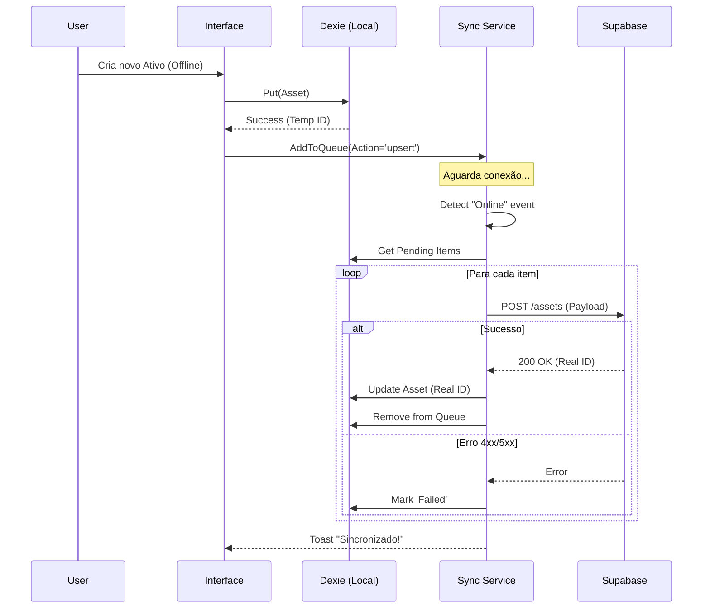

# 05. Engenharia de Dados

Detalhes da estrutura de dados, persistência e protocolos de comunicação.

## 1. Modelo Entidade-Relacionamento (Concetual)

## 2. Dicionário de Dados

Especificação técnica dos atributos para implementação em SQL e TypeScript.

### Tabela: `assets` (Ativos)

| Coluna | Tipo TS | Obrigatório | Descrição | Valores/Regras |
| :--- | :--- | :--- | :--- | :--- |
| `id` | string | Sim | Identificador único (UUID) | UUID v4 |
| `name` | string | Sim | Nome do ativo | Min 3 chars |
| `code` | string | Sim | Código patrimonial | Único |
| `location` | string | Sim | Localização física | Texto Livre |
| `condition` | string | Sim | Condição física | Enum: 'Novo', 'Bom'... |
| `status` | string | Sim | Status de disponibilidade | Enum: 'Disponível'... |
| `category` | string | Não | Categoria do ativo | Texto Livre |
| `model` | string | Não | Modelo | Texto Livre |
| `serial_number`| string | Não | Número de série | Texto Livre |
| `cost_center` | string | Não | Centro de custo | Texto Livre |
| `updated_at` | string | Não | Data de atualização | ISO 8601 (Auto) |

### Tabela: `products` (Produtos)

| Coluna | Tipo TS | Obrigatório | Descrição | Valores/Regras |
| :--- | :--- | :--- | :--- | :--- |
| `id` | string | Sim | Identificador único (UUID) | UUID v4 |
| `name` | string | Sim | Nome do produto | Min 3 chars |
| `sku` | string | Sim | Unidade de Manutenção de Estoque | Único |
| `category` | string | Sim | Categoria | Texto Livre |
| `quantity` | number | Sim | Quantidade atual | >= 0 |
| `min_stock` | number | Sim | Estoque mínimo | >= 0 |
| `unit_price` | number | Não | Preço unitário | >= 0.00 |

### Tabela: `stock_movements` (Movimentações)

| Coluna | Tipo TS | Obrigatório | Descrição | Valores/Regras |
| :--- | :--- | :--- | :--- | :--- |
| `id` | string | Sim | Chave Primária | UUID v4 |
| `type` | string | Sim | Tipo de movimento | 'entrada' / 'saida' |
| `quantity` | number | Sim | Quantidade | > 0 |
| `product_id` | string | Sim | ID do Produto | FK -> products.id |
| `user_id` | string | Sim | ID do Usuário | FK -> users.id |
| `reason` | string | Sim | Motivo da movimentação | Texto Livre |
| `date` | string | Sim | Data da movimentação | ISO 8601 (Auto) |

### Tabela: `maintenance_tasks` (Manutenção)

| Coluna | Tipo TS | Obrigatório | Descrição | Valores/Regras |
| :--- | :--- | :--- | :--- | :--- |
| `id` | string | Sim | Chave Primária | UUID v4 |
| `asset_id` | string | Sim | Ativo relacionado | FK -> assets.id |
| `title` | string | Sim | Título da tarefa | Min 5 chars |
| `due_date` | string | Sim | Data de vencimento | >= Hoje |
| `priority` | string | Sim | Prioridade | Enum: 'Baixa', 'Média', 'Alta' |
| `status` | string | Sim | Estado da tarefa | Enum: 'Pendente'... |

### Tabela: `checkouts` (Empréstimos)

| Coluna | Tipo TS | Obrigatório | Descrição | Valores/Regras |
| :--- | :--- | :--- | :--- | :--- |
| `id` | string | Sim | Chave Primária | UUID v4 |
| `item_id` | string | Sim | ID do Item (Ativo/Produto) | FK (Polimórfica) |
| `item_type` | string | Sim | Tipo do Item | 'asset' / 'product' |
| `user_id` | string | Sim | Responsável | FK -> users.id |
| `status` | string | Sim | Status do empréstimo | Enum: 'Ativo'... |
| `checkout_date`| string | Sim | Data de retirada | ISO 8601 (Auto) |

### Tabela: `users` (Usuários)

| Coluna | Tipo TS | Obrigatório | Descrição | Valores/Regras |
| :--- | :--- | :--- | :--- | :--- |
| `id` | string | Sim | Chave Primária | UUID v4 |
| `name` | string | Sim | Nome completo | Min 3 chars |
| `email` | string | Sim | E-mail | Formato de E-mail |
| `role` | string | Sim | Permissão / Papel | Enum: 'admin'... |
| `status` | string | Sim | Estado da conta | 'active' / 'inactive' |

### Outras Tabelas
- **audit_logs**: Histórico de ações de sistema (quem, o quê, quando).
- **cost_centers**: Centros de custo para agrupamento financeiro.
- **storage_locations**: Locais físicos de armazenamento.
- **asset_timelines**: Linha do tempo de eventos de um ativo.

## 3. Local Storage Schema (Dexie.js)

O banco `SisDavusDB` no IndexedDB espelha a estrutura relacional, mas é NoSQL (key-value store).
- **Versão**: 1
- **Índices**: `++id, name, code, sku...`
- **Diferença**: No Dexie, chaves estrangeiras são apenas strings indexadas, não há integridade referencial forte (Cascading Deletes) automática como no Postgres. A aplicação deve gerenciar a integridade via código.

## 4. Protocolo de Sincronização

Diagrama de sequência do processo de Sync (`offline-sync.ts`).

---

[Próximo: Design de Interface →](./06-Interface-Design.md)
