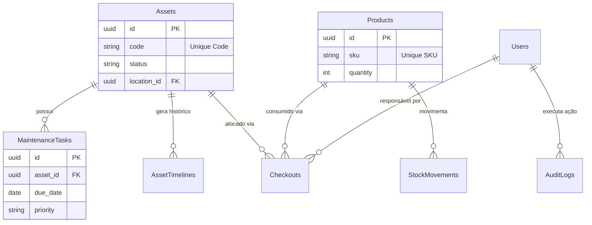
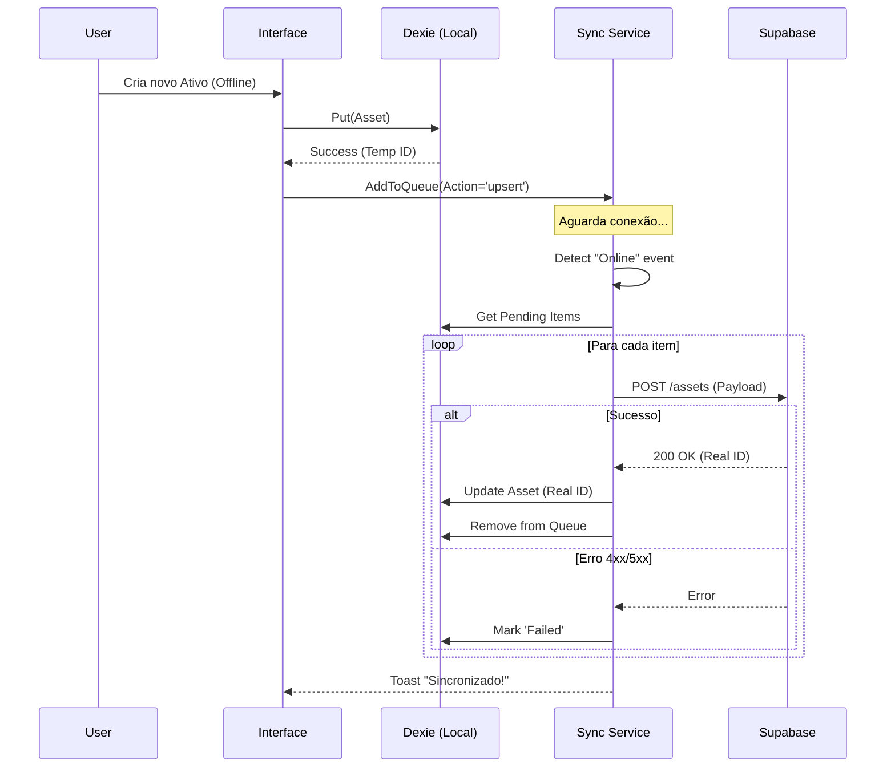

# 05. Engenharia de Dados

Detalhes da estrutura de dados, persistência e protocolos de comunicação.

## 1. Modelo Entidade-Relacionamento (Concetual)

## 2. Dicionário de Dados

Especificação técnica dos atributos para implementação em SQL e TypeScript.

### Tabela: `assets` (Ativos)

| Coluna | Tipo SQL | Tipo TS | Nullable | Descrição | Regras/Constraints |
| :--- | :--- | :--- | :--- | :--- | :--- |
| `id` | UUID | string | Não | Chave primária | `DEFAULT gen_random_uuid()` |
| `code` | VARCHAR(50) | string | Não | Código de etiqueta | `UNIQUE` |
| `name` | VARCHAR(255) | string | Não | Nome descritivo | Min 3 chars |
| `status` | VARCHAR(20) | enum | Não | Estado atual | 'Disponível', 'Em Uso', 'Manutenção' |
| `location` | VARCHAR(100)| string | Sim | Localização física | - |
| `created_at`| TIMESTAMPTZ | Date | Não | Data de criação | `DEFAULT NOW()` |
| `updated_at`| TIMESTAMPTZ | Date | Não | Última atualização | Trigger automático |

### Tabela: `stock_movements` (Movimentações)

| Coluna | Tipo SQL | Tipo TS | Nullable | Descrição | Regras/Constraints |
| :--- | :--- | :--- | :--- | :--- | :--- |
| `id` | UUID | string | Não | Chave Primária | - |
| `type` | VARCHAR(10) | enum | Não | Tipo de mov. | 'entrada' ou 'saida' |
| `quantity` | INTEGER | number | Não | Qtd movimentada | `> 0` |
| `product_id`| UUID | string | Não | Produto alvo | FK -> products.id |
| `user_id` | UUID | string | Não | Responsável | FK -> profiles.id |

*(O dicionário completo cobriria todas as tabelas, mantido resumido aqui por brevidade)*

## 3. Local Storage Schema (Dexie.js)

O banco `SisDavusDB` no IndexedDB espelha a estrutura relacional, mas é NoSQL (key-value store).
- **Versão**: 1
- **Índices**: `++id, name, code, sku...`
- **Diferença**: No Dexie, chaves estrangeiras são apenas strings indexadas, não há integridade referencial forte (Cascading Deletes) automática como no Postgres. A aplicação deve gerenciar a integridade via código.

## 4. Protocolo de Sincronização

Diagrama de sequência do processo de Sync (`offline-sync.ts`).

---

[Próximo: Design de Interface →](./06-Interface-Design.md)
