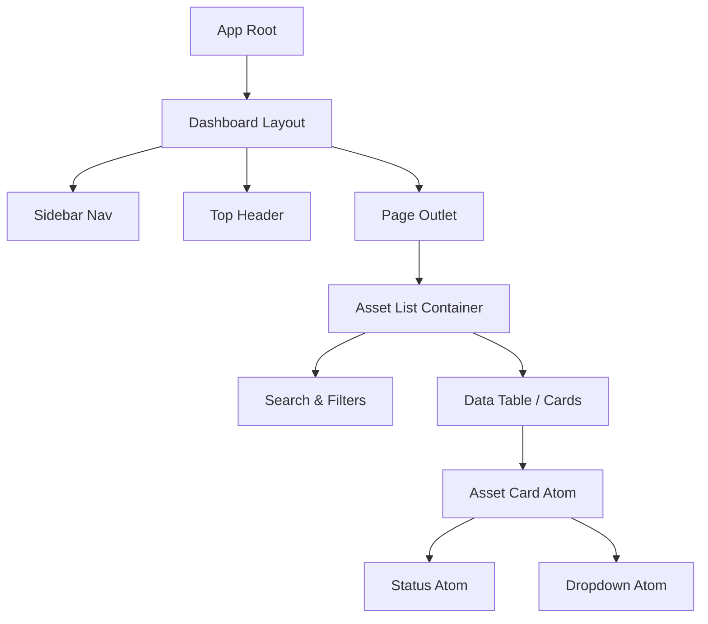

# 06. Design de Interface (UI/UX)

Documentação dos padrões visuais, heurísticas e arquitetura de componentes do frontend.

## 1. Design System

O projeto não utiliza uma biblioteca de terceiros "as-is", mas sim uma composição customizada (Shadcn-like) sobre **Tailwind CSS**.

### Design Tokens

- **Cores**:
  - `Primary`: Indigo-600 (`#4f46e5`) - Ação principal.
  - `Destructive`: Rose-600 (`#e11d48`) - Exclusão/Perigo.
  - `Background`: Slate-950 (`#020617`) - Fundo padrão (Dark mode first).
  - `Surface`: Slate-900 (`#0f172a`) - Cards e Modais.

- **Tipografia**:
  - Font Family: `Inter` (Sans-serif) para UI, `Geist Mono` para códigos/IDs.
  - Base Size: 16px (1rem).

- **Espaçamento**:
  - Grid de 4px (Tailwind standard).
  - Pads comuns: `p-4` (16px), `p-6` (24px).

### Acessibilidade (a11y)
O sistema adere às diretrizes WCAG 2.1 AA.
- **Contraste**: Verificado automaticamente nas cores base.
- **Navegação**: Todo componente interativo é focável via teclado (`Tab`).
- **Semântica**: Uso correto de `<button>`, `<a>`, `<dialog>` (via Radix UI).

## 2. Arquitetura de Componentes

O frontend segue o padrão **Atomic Design** modificado.

### Árvore de Componentes (Simplificada)

## 3. Heurísticas de Usabilidade (Nielsen)

Aplicação das 10 heurísticas de Jakob Nielsen no SisDavus:

1.  **Visibilidade do Status do Sistema**:
    - *Implementação*: Toasts de feedback para todas as ações (Salvo, Erro, Syncing). Loaders (Skeletons) durante fetch de dados.

2.  **Correspondência com o Mundo Real**:
    - *Implementação*: Uso de termos como "Depósito", "Etiqueta", "Baixa" em vez de termos de banco de dados ("Soft Delete", "Record").

3.  **Controle e Liberdade do Usuário**:
    - *Implementação*: Botões "Cancelar" em modais de edição. Confirmação dupla para ações destrutivas (Delete).

4.  **Consistência e Padrões**:
    - *Implementação*: Todos os formulários seguem o mesmo layout (Labels acima, inputs com validação on-blur).

5.  **Prevenção de Erros**:
    - *Implementação*: Máscaras em campos de data e moeda. Validação pré-envio com Zod.

---

